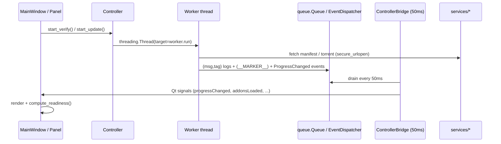
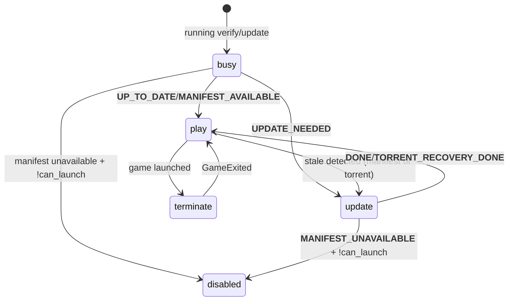

# CODEBASE_REVIEW — Vanilla WoW Launcher (`octo-updater`)

> A durable technical map and context-handoff document for the **Vanilla WoW
> Launcher** (importable package `vanilla_wow_launcher`, repo root `octo-updater`).
> Written for both a human developer picking up the project and a future AI
> agent that must modify, debug, or extend it.

All paths below are relative to the repository root. Claims are labelled where
necessary as **[verified]** (read directly in the code), **[inference]** (reasoned
from the code), or **[unknown]** (could not be confirmed).

---

## 1. Executive Summary

**What it is.** A cross-platform desktop companion for *Vanilla* (1.12.x) World
of Warcraft private-server clients. It updates the game client (incremental HTTP
+ optional BitTorrent bulk download), installs/updates server-registered
**mods** and Git-hosted **addons**, applies a curated set of `Config.wtf`
**tweaks**, renders the server's **news** feed, and launches the client (native
on Windows, through umu/Proton on Linux). It ships no game assets, mods, or
addons of its own — every endpoint and catalog is supplied by a single
`vanilla_wow_launcher.json` configuration file chosen by the user or the server.

**Domain.** Game client distribution / mod management for a single-player-hostile
binary-era Windows game, re-targeted at private servers.

**Primary technologies.** Python 3.10+, **PySide6** (Qt 6 GUI), **libtorrent**
(optional, lazily imported BitTorrent backend), and otherwise **pure
standard-library** business logic. Packaging via **hatchling** + **PyInstaller**;
dependency management via **uv**; tests via **pytest**; lint/format gate via
**ruff** (local-only, no CI step).

**Architecture.** Strict three-layer separation:
- **Toolkit-agnostic controllers** (`controllers/`) own all business logic and
  post dataclass *events* to a thread-safe `EventDispatcher` (`state/events.py`)
  from background worker threads.
- **Qt/PySide6 UI** (`ui/qt/`) renders events. A `ControllerBridge` drains the
  dispatcher on a 50 ms `QTimer` and re-emits `Qt` signals on the main thread.
- **Services** (`services/`) hold network + filesystem engines; **core**
  (`core/`) holds shared constants, config store, launcher config, hardened
  HTTP, platform helpers, and logging sink.

**Maturity / state.** Actively developed (last commit 2026-08-19, recent
`FullUpdateController` revert). **850 tests pass, 9 skipped** (e2e + display,
run only with opt-in env vars). The codebase is large (~22 kLOC including
tests; ~6 kLOC production Python), well-commented, with a thorough `AGENTS.md`
and `docs/`. It is **pre-1.0-ish in numbering (`v1.4.0`) but functionally
mature** for a single-maintainer-scale project.

**Strengths.** Clean layering; atomic, lock-guarded config persistence;
defense-in-depth on archive extraction; hardened TLS + HTTPS-only + host
allowlist transfer layer; offline-first caching; comprehensive test coverage
(with the e2e path properly isolated); thorough documentation.

**Weaknesses / risks.** A string-"marker" protocol (`__DONE__`, `__ERROR__`,
`__MANIFEST_AVAILABLE__`, …) shuttles control state through worker log queues
— powerful but brittle and under-tested. Several large modules mix concerns
(`http_update.py` ~1070 lines; `controllers/addons.py` `verify()` worker ~250
lines with duplication). A handful of **real bugs and dead code** exist
(see §12, §15). The client-update path trusts TLS-fetched torrent piece-hashes
with weaker re-verification than the docstrings claim. `certifi` was referenced
but never declared as a dependency — **now fixed (2026-08-21)**: it is a declared
dependency and its roots load.

---

## 2. Repository Map

```
octo-updater/
├── pyproject.toml                 # hatchling build, deps, ruff config, pytest config
├── uv.lock                        # uv-resolved lockfile
├── VanillaWoWLauncher.spec        # PyInstaller Windows onefile
├── VanillaWoWLauncher-linux.spec # PyInstaller Linux onedir (AppImage source)
├── VanillaWoWLauncher-macos.spec # PyInstaller macOS universal2 .app
├── packaging/
│   ├── pyinstaller_entry.py       # frozen entry shim → cli.main()
│   ├── fonts/STIXTwoMath-Regular.otf  # bundled glyph font
│   ├── icons/VanillaWoWLauncher.png
│   ├── linux/{AppRun, VanillaWoWLauncher.desktop, build-appimage.sh}
│   └── macos/{build-icons.sh, build-dmg.sh}
├── .github/workflows/{ci.yml, release.yml}
├── docs/{DEVELOPER.md, DISPLAY_TEST_MATRIX.md}
├── examples/{octowow.json, octowow_addons.json, octowow_mods.json}
├── servers.json                   # first-launch server picker index
├── src/vanilla_wow_launcher/
│   ├── cli.py                     # entry point; arg parsing, first-run wizard, backend
│   ├── __main__.py                # `python -m vanilla_wow_launcher`
│   ├── core/                      # constants, config_store, launcher, security_http,
│   │                              #   filesystem, helpers, log_sink, platform_support,
│   │                              #   errors, themes
│   ├── services/                  # catalog, mods, addons, news, tweaks, self_update,
│   │                              #   server_index, umu, logo, update_backend/
│   ├── controllers/               # update, news, mods, addons, settings, tweaks
│   ├── state/                     # models.py, events.py
│   └── ui/qt/                     # app, main_window, bridge, theme, panels, dialogs
└── tests/                         # pytest suite (mirrors module layout)
```

**Relationships.**
- `cli.py` is the only importable entry; it configures `core/launcher` and
  `core/config_store`, then constructs the Qt shell (`ui/qt/app.py`).
- The Qt shell builds a `ControllerHub` (`ui/qt/bridge.py`) which instantiates
  all six controllers on one shared `EventDispatcher`.
- Controllers depend on `services/*` (engines) and `state/*` (models + events);
  they never import `ui/`.
- `ui/qt/*` depends on `controllers` only through the injected hub/bridge and on
  `state/events` + `state/models`; it never calls services directly.
- `core/` is the shared bedrock: imported by services, controllers, and UI.

---

## 3. Technology Stack and Dependencies

| Area | Technology | Why it appears | Verified? |
|------|-----------|----------------|-----------|
| Language | Python ≥ 3.10 (3.10–3.13) | `pyproject.toml` `requires-python` | ✓ |
| GUI | PySide6 ≥ 6.6 | Qt 6 desktop UI | ✓ |
| BT client | `libtorrent` (only `python_version < "3.14"`) | optional BulkTorrent backend; lazy import | ✓ |
| TLS roots | `certifi >= 2024.0` | imported in `try/except` in `security_http.py`; now declared in `pyproject.toml` + `uv.lock` (added 2026-08-21) and bundles with frozen builds | ✓ |
| Build | hatchling | `pyproject [build-system]` | ✓ |
| Packaging | PyInstaller ≥ 6 | builds frozen exe/AppImage/.app/.dmg | ✓ |
| Dep mgmt | uv | lockfile + dev group | ✓ |
| Test | pytest ≥ 8, ruff ≥ 0.15 | test + lint gate | ✓ |
| CI/CD | GitHub Actions | `ci.yml` (test), `release.yml` (build+release) | ✓ |
| Fonts | STIX Two Math .otf | bundled glyphs for ⌕/⧉ icons | ✓ |
| Persistence | JSON files (no DB) | per-user config + hash cache | ✓ |
| External services | GitHub/Codeberg/GitLab/Gitea API + raw.githubusercontent; umu-launcher | catalogs, addon zips, mod releases, Linux launch | ✓ |

**Runtime requirements.** A display server (X11/Waywayland/macOS) except for
offscreen/headless tests; on Linux, `can_launch_client()` is True only if
`umu-run` is installed (or `~/.local/bin/umu-run`). On Windows the client
launches natively.

**No database.** All state is JSON on disk (config + caches) or in-memory
dataclasses. No telemetry, no credentials, no secrets stored.

**Obsolete / suspicious / unused dependencies.**
- `certifi`: referenced in `core/security_http.py:26-29` to add curated roots
  "in addition to the system store" (explicitly to fix Windows static-root
  staleness). It was **not in `pyproject.toml`/`uv.lock`** (the `import certifi`
  always failed → the *intended* mitigation was a no-op). **FIXED 2026-08-21**:
  `certifi>=2024.0` is now a declared dependency and the import succeeds,
  loading curated roots on top of the system store (and bundling with frozen
  builds). **[verified]**
- `controllers.full_update`: listed in all three PyInstaller specs'
  `hiddenimports`, but **no such module exists** (it was removed by the
  `FullUpdateController` revert — commit `582e93e`). PyInstaller emits a
  "hidden import not found" warning and continues; harmless but stale
  configuration. **FIXED 2026-08-21**: the stale hidden import was removed from
  all three specs. **[verified]**
- `core/filesystem.already_updated()` was **defined but never called** anywhere
  in `src/`. **FIXED 2026-08-21**: removed as dead code along with its test.
  **[verified]**
- `services/update_backend/torrent_update.py`: `write_resume_bytes()` and
  `resume_path()` are defined but **never invoked**; resume data is explicitly
  *not* loaded/saved in `TorrentDownloader.download()` (comment at
  `torrent_update.py:793-794` says so). `remove_resume_data()` *is* used
  (`http_update.py:344`) but only ever removes files that were never created →
  no-op. **[verified]**

**Duplicated functionality.**
- `controllers/addons.py:verify()`'s catalog-build loop (≈`services/addons.py`
  catalog parse) is duplicated almost verbatim in
  `controllers/addons.py:_ensure_catalog_loaded()`.
- `services/mods.py:install_mod()` contains four near-identical
  release/zip/tar extraction branches (codeberg_release, github_release,
  direct_tar, direct_file) with the same tar/zip handling repeated.

**Suspicious / risky dependencies.**
- `libtorrent` import is gated to `< 3.14` in `pyproject` because "libtorrent
  only ships wheels for CPython 3.10–3.13" — on 3.14+ the client update falls
  back to HTTP only. Reasonable, but a future 3.14 default interpreter would
  silently lose the torrent path. **[verified / inference]**

---

## 4. Architecture

### 4.1 Layering (verified)

```mermaid
graph TD
    subgraph UI["UI (ui/qt, PySide6)"]
      MW[main_window.py]
      PN[panels / dialogs]
      BR[bridge.ControllerBridge]
    end
    subgraph CTRL["Controllers (toolkit-agnostic)"]
      U[UpdateController] M[ModsController] A[AddonsController]
      N[NewsController] S[SettingsController] T[TweaksController]
    end
    subgraph STATE["state/"]
      EV[EventDispatcher] MD[models dataclasses]
    end
    subgraph SVC["services/"]
      CAT[catalog] MDX[mods] AD[addons] NW[news] TW[tweaks]
      UM[umu] SU[self_update] SI[server_index] LG[logo]
      UB[update_backend / http_update, torrent_update]
    end
    subgraph CORE["core/"]
      LS[launcher] CS[config_store] SH[security_http]
      FS[filesystem] PS[platform_support] TH[themes] HS[helpers] LSINK[log_sink]
    end

    MW --> BR --> EV
    PN --> BR
    CTRL --> EV
    CTRL --> SVC
    CTRL --> CORE
    SVC --> CORE
    UI -. no direct calls .-> SVC
```

Dependency direction is strictly **UI → controllers → (services, core)** and
**controllers → state → (services, core)**. UI never imports services;
controllers never import `ui`. `core` and `state` are leaf-ish (core imports
only stdlib + platform). **[verified]**

### 4.2 Event-driven control flow (verified)

Controllers spawn `threading.Thread` worker functions. Workers push progress
and log tuples into per-controller `queue.Queue`s, plus special
`"__MARKER__"` string messages, and also post `Event` dataclasses to the shared
`EventDispatcher`. The Qt side polls on timers:

- `MainWindow._logTimer` (50 ms) drains `core/log_sink._LOG_Q` → renders log.
- `MainWindow._pollTimer` (50 ms) calls `UpdateController.poll()` → drains the
  update log/prog queues and posts `ProgressChanged`/`LogMessage`.
- `ControllerBridge` `QTimer` (50 ms) drains the `EventDispatcher` → re-emits
  `Qt` signals consumed by `MainWindow` and panels.



### 4.3 Why it matters for an agent

The **string-marker protocol** is the linchpin of the update lifecycle. A
worker emits `"__DONE__"`, `"__ERROR__"`, `"__MANIFEST_AVAILABLE__"`,
`"__MANIFEST_UNAVAILABLE__"`, `"__UPDATE_NEEDED__"`, `"__DIFF_TREE__"`,
`"__TORRENT_REACHABLE__/UNREACHABLE/CORRUPT/STALLED/SESSION_ERROR/DISK_ERROR/VERIFY_FAILED/DIFF/UP_TO_DATE/RECOVERY_DONE__"`, and `"__VERSION__<ver>"`.
`UpdateController._handle_log()` switches on these and mutates `UpdateState`.
**Modifying either the worker's emitted markers or the handler is a breaking
change to this contract.** **[verified]**

---

## 5. Application Startup and Execution Flow

**Entry points (verified):**
1. `pyproject` console script `vanilla-wow-launcher = vanilla_wow_launcher.cli:main`.
2. `python -m vanilla_wow_launcher` → `cli.main()` (`__main__.py` → `cli.main`).
3. Frozen build → `packaging/pyinstaller_entry.py` → `cli.main()`.

**Sequence (`cli.py`):**

1. `cli.main(argv)` parses `--launcher-config` (`cli.py:31-44`).
2. `launcher.configure(args.launcher_config)` (`cli.py:74`). If it returns an
   error:
   - **explicit** `--launcher-config` → print error, `return 1`.
   - **no config / bad config** → enter first-run wizard
     (`cli._first_launch()` → `_pick_launcher_config()`).
3. First-run wizard (`launcher_config_dialog.py`):
   - `server_index.fetch_servers_index()` fetches `servers.json` (raw GitHub,
     unauthenticated). **[verified]**
   - User picks a remote server or a local `vanilla_wow_launcher.json`.
   - Remote selection → `server_index.fetch_server_config()` →
     `launcher.configure_from_dict()` → `launcher.persist_text()` (atomic write
     to `<config_dir>/vanilla_wow_launcher.json`).
   - Local file → `launcher.configure()` → `launcher.persist()`.
   - `cli._ensure_default_game_folder()`: default game dir to
     `~/Games/<ServerName>` (`platform_support.server_games_dir`).
4. `_run_backend()` (`cli.py:185-212`):
   - `config_store.configure(CONFIG_FILE, CACHE_FILE, legacy_*…)` — sets the
     global store paths and runs **legacy file migration** (copy old
     `octo_updater_*` / next-to-exe / XDG config files into the new per-user
     dirs).
   - Resolve backend via `VANILLA_WOW_UI_BACKEND` (default `qt`).
   - Construct `QtVanillaWoWLauncherApp` → `app.show()` → `app.run()` (Qt event
     loop).
5. `QtVanillaWoWLauncherApp.__init__` (`app.py:92-103`):
   - `create_qt_app()` (single `QApplication`, fonts loaded, HiDPI policy).
   - Build `ControllerHub` (all six controllers + bridge) and `MainWindow`.
   - `_center()` + resize, then `schedule_startup_tasks()` (deferred timers).
6. `MainWindow.__init__`: builds header/stack/footer, wires signals,
   starts `_logTimer` (50 ms) + `_pollTimer` (50 ms), and—if
   `hub.settings.state.first_run`—a single-shot 500 ms timer that opens the
   Settings dialog.
7. `schedule_startup_tasks()` (`main_window.py:780-796`) schedules (single-shot
   `QTimer`s):
   - +300 ms `start_verify()` (unless first-run verify is pending),
   - +600 ms `news.load()`,
   - +900 ms `mods.load_latest_versions()`,
   - +1500 ms `addons.verify(force=True)`,
   - +2000 ms `updater.check_updater_update()` (daily self-update check).
8. **Event loop runs**; background workers post events; `ControllerBridge`
   drains and re-emits; panels re-render.

**Shutdown (`MainWindow`):** `close()`/`closeEvent()` → `_teardown()`
(idempotent flag `_torn_down`):
- stops `_logTimer`, `_pollTimer`, all oneshot timers,
- `hub.updater.cancel()` (asks workers to stop),
- `hub.bridge.close()` (stops the dispatcher drain timer + unsubscribes).
**[verified]**

**Background workers / timers.** Verify/Update workers, news/mods/addons
fetch threads, the umu launch watcher (`_watch_game`), self-update thread, and
the mirror-probe thread. All daemon threads. **[verified]**

---

## 6. Core Components

### 6.1 `core/launcher.py` — process-global launcher configuration
- **Purpose.** Validate/parse the single `vanilla_wow_launcher.json`,
  resolving every endpoint (manifest, client, news, mods, addons, torrent,
  mirrors, discord, theme).
- **Interface.** `dataclass LauncherConfig` + `Mirror`; module functions
  `configure()`, `configure_from_dict()`, `reset()`, `persist()`,
  `persist_text()`, `validate_path()`, `validate_dict()`, `discover_path()`,
  `user_config_path()`, `server_url()`, `server_name()`, `realm()`,
  `mods_registry_url()`, `addons_registry_urls()`, `mirrors()`, … and `*_url()`
  accessors.
- **State.** Module-level `_config`, `_path`, `_error` guarded by `_LOCK`
  (threading). **Process-global singleton.** **[verified]**
- **Important behavior.** Only `server.base_url` is required; everything else
  is derived (e.g. `/api/file/latest/manifest.json`, `/client/latest`). All
  URLs must be **HTTPS** (`_https_url` rejects otherwise → `RuntimeError`).
  Downloads/mirrors may add `torrent_url`. `has_torrent()` / `download_hosts()`
  feed the security allowlist. Auto-discovery order: per-user
  `<config_dir>/vanilla_wow_launcher.json` → exe/repo-root → cwd.
- **Tests:** `tests/test_launcher.py`, `tests/test_launcher_firstrun.py`.

### 6.2 `core/config_store.py` — atomic JSON persistence
- **Purpose.** Read-modify-write the per-user config + hash cache, with
  lock-guarded `update_config()` and `_atomic_write()` (temp file + `os.replace`).
- **Interface.** `configure(cfg, cache, legacy_config=, legacy_cache=,
  legacy_pairs=)`, `load_config()`, `save_config()`, `update_config(mutator)`,
  `load_cache()`, `save_cache()`.
- **Concurrency.** `update_config` uses `_CONFIG_LOCK` (RLock). `save_cache()`
  is **not** lock-guarded (only `load_cache`/`save_cache` are independent
  functions; `UpdateWorker`/`VerifyWorker` both write the cache from separate
  threads — a minor race since the controller cancels one before starting the
  other, but not structurally safe). **[verified]**
- **Legacy migration.** `_migrate()` copies old location files into new paths
  on first `configure()`. **[verified]**

### 6.3 `core/security_http.py` — hardened transfer layer
- **Purpose.** All network downloads go through `secure_urlopen()`.
- **Enforcement.** HTTPS-only (`_check_url` raises on non-HTTPS); system TLS
  verify + hostname check + **TLS ≥ 1.2**; optional `allowed_hosts` allowlist
  on the *initial* URL only; `certifi` roots loaded (now declared, see §3);
  `_HttpsOnlyRedirectHandler` keeps every redirect HTTPS but **does not
  re-apply the host allowlist** (documented rationale: an allowlisted host
  controls its own redirects to its CDN). **[verified]**
- **`allowed_download_hosts()`** = base git hosts + every host from the
  configured server/mirrors. **[verified]**

### 6.4 `core/platform_support.py`
- `is_windows/macos/linux`, `can_launch_client()` (Windows True; Linux True
  only if `umu.umu_available()`), `can_manage_antivirus()`, per-OS
  `config_dir()` / `cache_dir()` / `data_dir()`, `server_games_dir()`,
  `open_folder()` (spawns `explorer`/`open`/`xdg-open`), `default_out_dir()`.
- **`open_folder`** uses `explorer.exe <path>` explicitly (not
  `os.startfile`) because ShellExecute would resolve a Desktop `.lnk` of the
  same name as an executable — a real security note in the code. **[verified]**

### 6.5 `core/state` — `models.py` + `events.py`
- `EventDispatcher` (thread-safe queue + handler list, `post`/`drain`/
  `dispatch_all`/`subscribe`/`unsubscribe`). **[verified]**
- Dataclass state models: `UpdateState`, `NewsState`, `ModState`, `ModsState`,
  `ModPending`, `AddonState`, `AddonsState`, `AddonError`, `SettingsState`,
  `LaunchSettings`, `LogEntry`, `AppState`. **[verified]**
- Event types: `StatusChanged`, `LogMessage`, `ProgressChanged`, `NewsLoaded`,
  `ModsLoaded`, `AddonsLoaded`, `MirrorStatusChanged`, `OperationFinished`,
  `OperationFailed`, `UpdateFilesList`, `GameLaunched`, `GameExited`.
  **[verified]**

### 6.6 `services/mods.py` — mod engine
- Installs from GitHub/Codeberg releases, or `direct_file`/`direct_tar`. Parses
  `extract_map` (validated via `catalog._valid_extract_map` → `safe_relpath`).
  Registers/unregisters DLLs in `dlls.txt`, detects unknown mods, computes
  cached latest-version + update-available.
- **Key risk:** when a release entry has **no `extract_map`**, the file is
  written to `client_dir/asset["name"]` directly (`mods.py:325, 383, 509`).
  `asset["name"]` is the release asset filename supplied by the mod's own repo
  — **not sanitized for path separators** by `catalog.validate_mod`. A malicious
  upstream mod repo could publish an asset named `../../evil.dll`. See §12.
  **[verified]**
- Writes a DXVK `dxvk.conf` via the `write_dxvk_conf` post-install hook
  (allowlisted). **[verified]**

### 6.7 `services/addons.py` — addon engine
- Installs from Git host archives (`github/gitlab/gitea/codeberg/octowow.st`)
  at a pinned **commit SHA** (resolved via API, with `git ls-remote`
  fallback). Archive extraction in `install_addon_files()` **is hardened**:
  strips top-level `<repo>-<sha>/`, skips empty/`..`, abspath-prefix guard,
  atomic `.tmp_install` → `os.replace`. This is the **correct** pattern the
  mods engine does *not* fully follow. **[verified]**
- Patches pfUI's `profiles.lua`/`pfUI.lua`/`firstrun.lua` with a curated
  "Default" profile (idempotent, marker-delimited regex). **[verified]**
- `addon_remote_sha()` does **not** enforce the git-host allowlist when called
  from the *verify* worker (only `is_allowed_git_url` is checked at install
  time). See §12. **[verified]**

### 6.8 `services/update_backend/http_update.py` — HTTP update/verify
- `VerifyWorker.run()`: fetch manifest → build `diff_nodes` tree by comparing
  `cached_sha1` (mtime-keyed) vs manifest `hash` → emit `__DIFF_TREE__`,
  `__UPDATE_NEEDED__`, `__UP_TO_DATE__`, or on manifest failure try the
  torrent verify path.
- `UpdateWorker.run(diff_nodes, torrent_wanted)`: resolves `DownloadSource`
  (mirror failover via `_download_source` probing `manifest_url`+`client_url`),
  optionally bulk-downloads stale files via `TorrentDownloader`, else
  `traverse()` per-file HTTP with resume + hash-mismatch retry (max
  `DOWNLOAD_RETRY=5`, `DOWNLOAD_TIMEOUT=10s`). Writes/`remove_wdb`,
  posts `__DONE__`, reads client version from fixed WoW.exe offsets.
- Manifest-less recovery (`_recovery_download`): full/partial torrent download
  when no manifest is fetchable. **[verified]**

### 6.9 `services/update_backend/torrent_update.py` — BitTorrent backend
- `available()`: probe libtorrent import + symbols.
- `_fetch_torrent()`: TLS + allowlisted fetch of `.torrent` (5 MiB cap), parse,
  persist `.torrent` by info-hash, return `TorrentSnapshot`.
- `_detect_torrent_root()`: auto-detect root from the unique `WoW.exe`
  position; raise `TorrentLayoutError` on missing/duplicate/escaping root.
- `_remap_torrent_to_out_dir()`: strip root via `ti.remap_files` (no-op on test
  fakes) so files land under `out_dir` directly (the bug that spawned
  `BITTORRENT_UPDATER_NOTES.md`).
- `TorrentVerifier`: **offline** session (`listen_interfaces=""`, DHT/LSD/
  UPnP/NAT-PMP off), `force_recheck()`+`resume()`, stall-guarded wait.
- `TorrentDownloader`: **online** session (`0.0.0.0:0`, DHT bootstrap nodes,
  UPnP/NAT-PMP on, `UPLOAD_RATE_LIMIT=-1` unlimited), priority-based selective
  download. **[verified]**

### 6.10 `services/umu.py` — Linux launch (Proton/Wine)
- `find_umu()`, `umu_available()`, `resolve_proton()`, `list_protons()`,
  `build_env()`, `launch()`, `kill_game()`. `launch()` returns
  `(pid, pgid, proc)` and spawns detached. **Notable bug:** `launch()` accepts a
  `wayland` argument that **now forwards to `build_env`** (previously the
  `wayland` value was dropped, so `PROTON_ENABLE_WAYLAND` was never set —
  **fixed 2026-08-21**, see K1/§15). **[verified]**

### 6.11 `controllers/*` (toolkit-agnostic orchestration)
- `update.py` (UpdateController): owns verify/update lifecycle, readiness
  state machine (`compute_readiness` → mode `play`/`update`/`busy`/`disabled`/
  `terminate`), game launch (`_launch_game_windows`/`_launch_game_via_umu`),
  `_watch_game`, `terminate_game`, `poll()`.
- `mods.py` (ModsController): registry, latest-version fetch, pending toggles,
  `_apply_worker` install/uninstall/update sequence, essential-mods seeding,
  unknown-mod removal.
- `addons.py` (AddonsController): catalog merge, disk scan + `.toc` parse,
  sha-based update detection, `_apply_worker`/`_apply_pending_worker`.
- `news.py` (NewsController): TTL-gated fetch (300 s), featured + items.
- `settings.py` (SettingsController): game-folder change reset, Defender
  exclusion, mirror probe, catalog URL override, umu settings, first-run
  scheduling. **Note the PowerShell injection in `allow_through_antivirus()`
  — see §12.**
- `tweaks.py` (TweaksController): clamp + apply/reset `Config.wtf`.

### 6.12 `ui/qt/*`
- `app.py` (`QtVanillaWoWLauncherApp`, `create_qt_app`), `main_window.py`
  (chrome, tabs, footer, timers, startup scheduling, teardown), `bridge.py`
  (`ControllerBridge` + `ControllerHub`), `theme.py` (palette + QSS),
  `update_panel.py`, `news_panel.py`, `mods_panel.py`, `addons_panel.py`,
  `tweaks_panel.py`, `settings_dialog.py`, `linux_settings_dialog.py`,
  `launcher_config_dialog.py`, `custom_addon_dialog.py`, `log_window.py`,
  `list_panel.py`, `metrics.py`. **[verified]**
- **2026-08-21 UI refresh**: recurring button looks are QSS *variants*
  (`setProperty("variant", ...)` → `theme_qss` rules: `primary`/`positive`/
  `outline`/`compact`); all palette slots (incl. `pink`/`warn`/`btn_text`) are
  themable via `core/themes.DEFAULT_COLORS`; shared helpers live in
  `list_panel.py` (`LinkLabel`, `ClickableLabel`, `clear_layout`,
  `make_hairline`); typography/spacing use the PT_*/PAD_* tokens in
  `metrics.py`; the first-launch wizard fetches server configs on a worker
  thread (poll timer applies results — no GUI-thread network); mods rows gate
  their action buttons while an apply runs; `_log_buffer` is a 2 000-line
  ring buffer. Conventions documented in `AGENTS.md`.

---

## 7. Data Model and State

### 7.1 On-disk files
| File | Location | Shape | Owner |
|------|----------|-------|-------|
| Launcher config | `<config_dir>/vanilla_wow_launcher.json` | the server config JSON | `core/launcher` |
| App config | `<config_dir>/vanilla_wow_launcher_config.json` | arbitrary JSON (see keys below) | `core/config_store` |
| Hash cache | `<cache_dir>/vanilla_wow_launcher_hash_cache.json` | `{path: [sha1_upper, mtime]}` + `__torrent_validation__` | `UpdateWorker`/`VerifyWorker` |
| Custom mods | `<config_dir>/vanilla_wow_launcher_mods_custom.json` | JSON list | `services/catalog` |
| Custom addons | `<config_dir>/vanilla_wow_launcher_addons_custom.json` | JSON list | `services/catalog` |
| Torrent cache | `<cache_dir>/torrents/<info_hash>.torrent` (and `.resume`) | bytes | `torrent_update` |
| Logo cache | `<cache_dir>/launcher_logo.img` | binary pixmap | `services/logo` |

### 7.2 Important on-disk config keys (`vanilla_wow_launcher_config.json`)
`out_dir`, `client_update_enabled`, `mods` (`{id: {enabled, installed_version,
installed_files, error}}`), `addons` (`{folder: {git, branch,
ref, sha}}`), `tweaks`, `launch` (`{umu_proton, umu_binary_path, umu_game_id,
umu_renderer, umu_gamemode, umu_wayland}`), `mods_registry_url`,
`addons_registry_url`, `mods_catalog_cache`, `addons_catalog_cache`
(`{url: {timestamp, catalog}}`), `mod_release_cache`, `addon_sha_cache`,
`updater_release_cache`, `dxvk_notice_pending`, `clear_wdb_on_launch`,
`close_on_launch`. **[verified largely; inferred key set from controller/service code]**

### 7.3 Caches & TTLs (verified)
- `NEWS_CACHE_TTL = 300` (news).
- `ADDONS_CATALOG_TTL = 86400` (per-URL addon catalog).
- `ADDON_SHA_CACHE_TTL = 3600` (addon commit sha).
- `ADDONS_VERIFY_TTL = 300` (in-memory verify skip on tab switch).
- `_MOD_VERSION_CACHE_TTL = 3600` (mod release).
- `UPDATER_CHECK_TTL = 86400` (self-update).
- **Mods catalog has NO TTL** — `fetch_mods_catalog(force=False)` returns the
  cached list forever (only `force=True` from Settings→Reload or a network
  fallback refreshes). **[verified — potential staleness]**

### 7.4 Session state (in-memory, `state/models.py`)
- `UpdateState` (footer + torrent + game-process fields), `ModsState`,
  `AddonsState`, `NewsState`, `SettingsState`, `LaunchSettings`.
- **Ownership/lifecycle.** Controllers *own* their `*State`; `MainWindow` reads
  them for rendering. Game-process fields (`game_running/pid/pgid`) are mutated
  by `UpdateController` and reconciled with `GameLaunched`/`GameExited` events.
- **Invariant:** exactly one game process at a time — `launch_game()` refuses
  when `state.game_running`; `terminate_game()` (SIGTERM to process group, then
  SIGKILL after 2 s on Linux) is the only exit path. **[verified]**

### 7.5 State diagram — footer readiness (`UpdateController.compute_readiness`)


---

## 8. External Interfaces

### 8.1 CLI
- `--launcher-config PATH` (`cli.py:31-44`). No other flags. **[verified]**

### 8.2 Environment variables
| Var | Effect | Verified |
|-----|--------|----------|
| `VANILLA_WOW_UI_BACKEND` | backend selector (`qt`/`pyside6`, default `qt`) | ✓ |
| `VANILLA_WOW_DEBUG` | mirror log lines to stdout (non-`0/false/no`) | ✓ (`log_sink.py`) |
| `QT_QPA_PLATFORM` | Qt platform (`offscreen` for tests) | ✓ (tests) |
| `XDG_CONFIG_HOME`/`XDG_CACHE_HOME`/`XDG_DATA_HOME` | per-user dir roots (Linux) | ✓ |
| `APPDATA`/`LOCALAPPDATA` | per-user dir roots (Windows) | ✓ |
| `GIT_TERMINAL_PROMPT`, `PATH`, `HOME`, `XDG_SESSION_TYPE`, `WAYLAND_DISPLAY` | used by `umu`/`git`/`git ls-remote` | ✓ |
| `LINUXDEPLOY`, `APPIMAGE_EXTRACT_AND_RUN`, `UV_PYTHON`, `CODESIGN_IDENTITY`, `NOTARY_*` | build-time only | ✓ |

### 8.3 Network endpoints (all HTTPS, configured by `vanilla_wow_launcher.json`)
- Server base + derived (`/api/file/latest/manifest.json`, `/client/latest`,
  `/forum/octonews.php?…`, `/api/mods.json`, `/api/addons.json`, torrent).
- Mirrors (same shape, optional `torrent_url`).
- `servers.json` at `LAUNCHER_SERVERS_INDEX_URL`
  (`raw.githubusercontent.com/Ourouk/vanilla-wow-launcher/main/servers.json`).
- GitHub/Codeberg/GitLab/Gitea REST API (addon commit SHAs, mod releases).
- `git ls-remote` to addon Git repos (fallback).
- `api.github.com/repos/Ourouk-vanilla-wow-launcher/releases/latest` (self-update).
- `security_http` enforce: HTTPS-only + optional host allowlist + HTTPS-only
  redirects + TLS ≥ 1.2 + cert verification. **[verified]**

### 8.4 Filesystem writes
- `Config.wtf` (`WTF/Config.wtf`) — written/updated by `tweaks`.
- `dlls.txt` — mod DLL registration.
- Game client files (`Data/…`, `*.mpq`, etc.) — update/mod/addon installs.
- `dxvk.conf` — mod post-install hook.
- Legacy migration copies. **[verified]**

### 8.5 Subprocess invocations
| Command | Trigger | Risk note |
|---------|---------|-----------|
| `git ls-remote <url> [ref]` | addon sha fallback | args list (no shell); `GIT_TERMINAL_PROMPT=0`; url https-only but host allowlist NOT applied (see §12) |
| `umu-run <exe>` (+ optional `gamemoderun`) | Linux launch | env-injected; cwd=out_dir; detached |
| `explorer.exe <path>` / `open` / `xdg-open` | open folder | explorer chosen deliberately (see §6.4) |
| `powershell.exe -Command "Add-MpPreference -ExclusionPath '<path>'"` | Windows Defender exclusion | **single-quote injection** (see §12) |
| `WoW.exe` / `VanillaFixes.exe` | game launch (Windows) | DETACHED_PROCESS|CREATE_BREAKAWAY_FROM_JOB with retry |
| `magick`/`convert`, `linuxdeploy`, `lipo`, `pyinstaller` | build-time only | not runtime |

---

## 9. Configuration and Environment

**Mandatory.** A valid `vanilla_wow_launcher.json` with `server.base_url`
(HTTPS). Without it and without `--launcher-config`, the first-launch wizard
is shown (which itself fetches `servers.json` over HTTPS). **[verified]**

**Optional.** `mirrors[]`, `torrent_url` (server/mirror), `theme`
(`C_*` colors + `logo` URL), `discord_url`, `addons_registry_urls`,
`realm`, `*_news_url`, `*_registry_url` overrides. **[verified]**

**Defaults.**
- `DEFAULT_OUT_DIR`: Windows `exe_dir/VanillaWoW`; else `~/VanillaWoW`
  (`platform_support.default_out_dir`).
- First-run default game folder: `~/Games/<ServerName>`
  (`cli._ensure_default_game_folder`) — *differs* from `DEFAULT_OUT_DIR`,
  which is what `SettingsState.path` initializes to. A subtle inconsistency:
  the Settings field shows `~/VanillaWoW` while `cli` sets `~/Games/<server>`
  only if the field is empty. **[verified / inference]**
- `TWEAKS_DEFAULTS`, `fov_default_for_display()` (display-ratio-based FOV).
- `umu` defaults: `UMU-Proton`, renderer `auto`, gamemode on, wayland on.

**Environment-specific behavior.**
- Windows: native launch + Defender exclusion wizard; config in `%APPDATA%`.
- macOS: config in `~/Library/Application Support`; frozen `.app` searches
  parent-of-bundle for the config.
- Linux: launch only via umu; config in `~/.vanilla-wow-launcher`.

**Dangerous defaults / risks.**
- `client_update_enabled` defaults to **True** — on first run the launcher
  immediately verifies/updates the client folder. Minor. **[verified]**
- `gxApi` derived from `launch.umu_renderer` (`dxvk-d3d8`→`d3d8`,
  `wined3d-opengl`→`opengl`); wrong value could render the client unusable on
  Linux, but gated behind explicit user setting. **[verified]**
- `Config.wtf` `realmList`/`patchList` use `launcher.realm()` or
  `server_url()` host **without sanitization** — a malicious launcher config
  with a `realm` containing quotes/newlines would inject extra `SET` lines into
  the game config (`tweaks.write_config_wtf`). Low impact (game settings),
  config is TLS-fetched/validated as JSON only. **[verified]**

---

## 10. Build, Development, Testing, and Deployment

**Install / run (verified from `AGENTS.md` + `pyproject`):**
- `uv sync` → installs package (editable) + PySide6 + dev group.
- `uv run vanilla-wow-launcher` (or `uv run python -m vanilla_wow_launcher`).
- Optional `--launcher-config examples/octowow.json`.

**Testing (verified):**
- `uv run pytest` runs the whole suite; **850 passed, 9 skipped**.
- `uv run pytest -m e2e` (needs real client under `context/` + `RUN_E2E=1`) —
  skipped in CI.
- `uv run pytest -m "not e2e"` in `ci.yml`.
- Coverage of controllers, services, state, core, and Qt panels (offscreen).
- Tests monkeypatch by **full dotted path**
  (`vanilla_wow_launcher.ui.qt.addons_panel.QMessageBox.question`); libtorrent is
  mocked via `sys.modules["libtorrent"]`; launcher state reset per test via
  autouse `_launcher_env` fixture (`tests/conftest.py`).
- A known-flaky test is explicitly tolerated (`test_addons_controller.py::
  test_apply_failure_records_error_and_posts_finished`). **[verified]**

**Lint / format (verified):**
- `uv run ruff format .` (79-col, `target-version=py310`).
- `uv run ruff check .` selects `E4/E7/E9/F/I/W/UP/B`. **This is the only
  lint/format gate and it runs LOCALLY — there is NO ruff step in CI**
  (`ci.yml` only runs `pytest`).** `pyproject` notes this explicitly.

**Packaging / deploy (verified):**
- Three PyInstaller specs freeze the package from `packaging/pyinstaller_entry.py`
  (`pathex=["src"]`, full hidden-imports list). Windows = onefile; Linux =
  onedir → AppImage via `build-appimage.sh` (needs `linuxdeploy` + ImageMagick
  + `libegl1`); macOS = universal2 `.app` → `.dmg` via `build-dmg.sh` (needs
  universal Python, unsigned by default).
- **`release.yml`** builds on `v*` tag push across Windows/Linux/macOS, each
  job independent; the **release job runs on `always()` + (any-of
  success)** so one platform failing does not block the others. Uploads
  artifacts + `sha256` checksums + `octowow-config-example.json`.
- **Releases are unsigned** (README notes SmartScreen warning). CI installs
  `libegl1` for headless Qt.

**Gaps / inconsistencies (verified):**
- Stale `controllers.full_update` hidden imports in all three specs (module
  removed). **[verified]**
- certifi never installed though security code expects it.
- No type checker in toolchain (ruff only). `pyproject` explicitly states this.

---

## 11. Error Handling and Reliability

**Exception handling patterns (verified):**
- Workers catch broadly and `log()` the error, then post `"__ERROR__"` (update)
  or `OperationFailed`. UI never crashes from a worker exception.
- Downloads: `DOWNLOAD_RETRY=5` attempts with exponential backoff
  (`min(2**attempt,10)` s), resume from partial `.tmp` via `Range` header,
  short-file detection (`size and downloaded != size` → `OSError`, retry),
  and a guard against silent truncation on dropped connections.
- Torrent verifier/download: stall timeouts `STALL_TIMEOUT=60`,
  `DISCOVERY_TIMEOUT=180`; distinct typed exceptions
  (`TorrentCorrupt/Fetch/Stalled/Session/Disk/Layout/MismatchError`) mapped to
  distinct `__TORRENT_*__` markers so the UI can offer the right fallback.
- Offline-first caching: every catalog/sha/news/mirror failure falls back to
  the last cached copy or an empty list rather than crashing.

**Where failures can be silently swallowed (verified / concern):**
- `config_store.load_config()` swallows all exceptions → `{}` (a corrupt config
  silently becomes empty → app may run with no `out_dir`).
- `log_sink` failures are swallowed; `debug_emit` swallow.
- `save_cache` has no lock → concurrent writers (verify vs update) could
  interleave, but controller cancels one before starting the other.
- `tweaks.write_config_wtf` never raises (logs error) — a failed write leaves a
  stale/missing `Config.wtf` but the UI still reports "Config.wtf written".
- `fetch_mods_catalog(force=False)` returns `None` → empty registry when no
  cache and offline — mods tab silently empty (by design, acceptable).

**Crash / data-loss risks (verified):**
- `VerifyWorker`/`UpdateWorker` mutate the game folder; on cancel they stop at
  the next chunk/node boundary, leaving a partial `.tmp` download. The partial
  `.tmp` is intentionally retained for resume, but a crashed mid-write `.tmp`
  is reused next run (`got >= size` → restart; else resume) — safe.
- `rmtree_force` (addon removal / `.tmp_install` cleanup) removes read-only
  files — intended, but it is destructive; an addon folder name collision
  could remove the wrong dir (names are validated via `safe_folder`, so a
  non-folder name can't be adopted, limiting blast radius).
- Kill-game uses `SIGKILL` after 2 s — could interrupt a save; acceptable for a
  game client.

**Reliability strengths.** Atomic JSON writes everywhere (`config_store`,
`torrent_update`, `launcher.persist`); identity-aware torrent validation cache
(detects snapshot replacement via content/info hash); manifest-less recovery
with `WoW.exe`-presence gate before marking ready.

---

## 12. Security Review

> Severity scale: Critical / High / Medium / Low / Informational. Each item is
> **verified** against the code unless noted.

### 12.1 [Medium] PowerShell command injection in Defender exclusion
- **Location:** `controllers/settings.py:195-203` (`allow_through_antivirus`).
- **Description:** `cmd = f"Add-MpPreference -ExclusionPath '{client_dir}'"`
  is interpolated into a single-quoted PowerShell string. The path comes from
  the user's game-folder text field (`SettingsState.path`). A path containing a
  single quote (e.g. `C:\Users\O'Brien\Games\OctoWoW`) breaks out of the quote
  and injects arbitrary PowerShell, executed via
  `ShellExecuteW(..., "runas", ...)` → **elevated (admin/UAC)**.
- **Impact:** Local privilege escalation to admin, via a crafted game-folder
  path the user themselves typed (social-engineering / self-inflicted vector,
  but still a real injection).
- **Conditions:** Windows only; user must approve the UAC prompt; path must
  contain a `'`.
- **Remediation:** **FIXED 2026-08-21** — the command is now passed via
  `-EncodedCommand` (UTF‑16LE base64) *and* the path travels inside the script
  as a base64 blob decoded with `[Convert]::FromBase64String`, so no shell or
  PowerShell quoting exists to break out of. Regression tests decode the
  payload and assert a `'`/newline-bearing path stays inert.

### 12.2 [Low–Medium] Mod asset filename used as install path unsanitized
- **Location:** `services/mods.py:325, 383, 509` (`install_mod`, release kinds
  with `extract_map is None`: `dest_rel = asset["name"]` →
  `os.path.join(client_dir, dest_rel)`).
- **Description:** When a catalog mod release has no `extract_map`, the file is
  written to `<client_dir>/<release-asset-filename>`. The asset filename is
  supplied by the mod's own GitHub/Codeberg repo (the publisher pins
  `owner/repo` in the *catalog*, but the release assets are attacker-controllable
  if that repo is compromised). `catalog.validate_mod` sanitizes `dest` and
  `extract_map` values via `safe_relpath`, but **does not sanitize the release
  asset name**. A malicious/compromised upstream repo could publish an asset
  named `../../evil.dll`, writing outside `client_dir`.
- **Impact:** Arbitrary file write relative to `client_dir`'s parent; on a
  default `~/Games/<server>` layout this could reach user home or elsewhere.
  Requires a compromised mod upstream.
- **Remediation:** **FIXED 2026-08-21** — all three install sites route
  through `mods._checked_rel()`, which enforces `catalog.safe_relpath`
  (traversal/absolute/NUL names raise `RuntimeError`); covers the release
  asset name (both release kinds) and `direct_file` `dest` for custom local
  catalogs. Regression tests cover traversal assets and unsafe-name rejection.

### 12.3 [Low] Mod/addon catalog-controlled git URL bypasses host allowlist for metadata
- **Location:** `services/addons.py:addon_remote_sha` (called from
  `controllers/addons.py:verify` worker at `~:235,266,298` **without**
  `is_allowed_git_url`), and `_api_json`/`_github_latest`/`_codeberg_latest`
  call `secure_urlopen` **without `allowed_hosts`**.
- **Description:** A *remote* (server-configured) addon catalog is only
  length-validated (`catalog.validate_addon`), not host-restricted. The verify
  worker then resolves commit SHAs against `rec["git"]` (any HTTPS host) via
  API and `git ls-remote`. Installs *are* gated by `is_allowed_git_url` in
  `_apply_worker`, so only metadata lookups hit arbitrary hosts.
- **Impact:** SSRF-ish reachability to arbitrary HTTPS hosts (no creds, no
  data exfiltration of secrets); limited, but broader than the intended
  git-host allowlist.
- **Remediation:** Enforce `is_allowed_git_url` (or the host allowlist) at all
  catalog-parse/verify sites, including remote catalog entries; apply
  `allowed_hosts` to the `_api_json`/`git ls-remote` calls.

### 12.4 [Low] Unsanitized `dlls.txt` entries used in filesystem delete
- **Location:** `services/mods.py:remove_unknown_mod` (joins
  `client_dir/<name>` where `name` is a line from `dlls.txt`),
  `add_dll`/`remove_dll` (same). `dlls.txt` is written by mods and could be
  tampered with locally.
- **Impact:** A crafted `dlls.txt` line `../../foo` could delete a file
  outside `client_dir`. Requires local filesystem write access / malicious mod.
- **Remediation:** **FIXED 2026-08-21** — `remove_unknown_mod` only resolves
  an entry to a path when it passes `catalog.safe_relpath` (the dlls.txt line
  is still dropped), and `add_dll` refuses to write unsafe entries
  (`remove_dll` was already text-only). Regression tests cover both.

### 12.5 [Low] `Config.wtf` values not sanitized for quotes/newlines
- **Location:** `services/tweaks.py:write_config_wtf` (`f'SET {k} "{v}"\n'`)
  with `v` derived from `launcher.realm()`/`server_url()` (config-controlled).
- **Impact:** A malicious launcher config with a `realm` containing `"` or
  newline injects extra config lines. Impact limited to game client settings;
  config is TLS-fetched JSON (not shell).
- **Remediation:** **FIXED 2026-08-21** — `tweaks._wtf_str()` strips `"`,
  `\r`, `\n` and NUL from the config-derived realm/server host before it is
  written into `SET k "v"` lines. Regression test uses a hostile realm.

### 12.6 [Low/Informational] `certifi` intended but never installed
- **Location:** `core/security_http.py:25-30` (soft `import certifi`); was absent
  from `pyproject.toml` + `uv.lock`.
- **Description:** The TLS context tries to load certifi's roots "in addition
  to the system store, so a stale/static Windows root store can't break
  verification." Because certifi was never a dependency, the import always failed
  and only the system store was used. On frozen Windows builds this is the only
  store. **The documented mitigation was a no-op.**
- **Impact:** Potential TLS verification failures in locked-down Windows
  environments; also a latent bug if certifi ever *is* added without pinning.
- **Remediation:** **FIXED 2026-08-21** — `certifi>=2024.0` declared in
  `pyproject.toml` (and `uv.lock` regenerated); the import now succeeds and
  curated roots load on top of the system store. PyInstaller already bundles the
  whole venv, so the root bundle ships with frozen builds.

### 12.7 [Informational] Overstated re-verification in torrent docstring
- **Location:** `services/update_backend/torrent_update.py:1-15` vs
  `http_update.py:1039-1048`. The module docstring claims the caller "still
  re-verifies every file against the manifest's SHA-1 afterwards, so the
  torrent backend cannot weaken the integrity guarantee." In
  `UpdateWorker.run`, when `_torrent_download` returns True,
  `traverse()` (the per-file SHA-1 recheck) is **skipped** — integrity then
  rests solely on the torrent's piece hashes, which arrived over TLS from a
  configured host (same trust level as the manifest, but the claim is
  inaccurate).
- **Remediation:** Update the docstring, or (preferably) re-run a per-file
  SHA-1 check against the manifest after the torrent bulk download to actually
  preserve the stated guarantee.

### 12.8 [Informational] Redirect allowlist not re-applied (by design)
- `security_http._HttpsOnlyRedirectHandler` keeps redirects HTTPS but does not
  re-check the host allowlist. This is a deliberate, documented trade-off (an
  allowlisted host legitimately redirects to its CDN). TLS still authenticates
  the final host. Acceptable, but noted for completeness.

### 12.9 [Informational] News HTML is safely rendered
- `ui/qt/news_panel.py:171` renders the featured post body as
  `setPlainText(strip_html(...))` — remote HTML is reduced to plain text; no
  `setHtml`/`QTextBrowser` rich-text rendering of untrusted content, so no
  HTML/JS injection or remote-image tracking surface. **Verified safe.**

### 12.10 [Informational] No secrets / no telemetry
- The launcher stores no credentials, API keys, or tokens; it only caches
  public release/commit metadata. No network telemetry. Downloads are
  HTTPS-only with cert verification.

### 12.11 [Informational] Unpinned/unverified release assets
- Mod/addon install trusts SHA-1 manifest hashes (client update) and commit-SHA
  pins (addons) — both reasonable. Mod release downloads are identified only by
  `asset_pattern` + optional `prefer_no`; a compromised upstream could swap the
  asset behind a matching pattern. This is inherent to the distribution model
  (server-operated catalog), not a code defect.

---

## 13. Code Quality and Maintainability Review

**Well-designed / worth preserving.**
- Strict controller↔UI separation via events; UI never imports services.
- Atomic, lock-guarded config writes + legacy migration.
- Defense-in-depth archive extraction in addons (`install_addon_files`).
- Allowlisted mod source kinds + post-install hooks (no arbitrary code from
  catalog JSON).
- Comprehensive, well-commented test suite (850 pass) with proper e2e
  isolation.

**Problematic areas.**
1. **String-marker control protocol** (`__DONE__`, `__ERROR__`, `__TORRENT_*__`,
   `__VERSION__…`) flows through the *log* queue and is dispatched by
   `UpdateController._handle_log` (~40-branch `if/elif`). It is powerful but
   brittle: a typo or missing handler silently mis-transitions `UpdateState`.
   Tests cover much of it (`test_client_update.py`, `test_update_controller.py`)
   but the coupling is high.
2. **Oversized modules.** `http_update.py` (~1070 lines, mixed verify +
   update + recovery + torrent glue), `controllers/addons.py` (`verify()`
   worker ~250 lines + duplicated `_ensure_catalog_loaded`), `mods.py` service
   (`install_mod` four near-identical branches). High cognitive load; changes
   ripple.
3. **Duplicated catalog-parse logic** in `controllers/addons.py`
   (`verify` worker vs `_ensure_catalog_loaded`) — drift risk.
4. **Process-global mutable singleton** (`core/launcher._config` + `_LOCK`).
   Tests must `reset()`/`configure_from_dict()` per fixture; any code path that
   reads `launcher.config()` without ensuring init will get `None`.
5. **`save_cache` unlocked** (see §11) — latent race.
6. ~~**`build_env(wayland=...)` argument dropped** in `umu.launch` (see §15) —
   a silent correctness bug introduced by mismatch between function signatures.~~
   **FIXED 2026-08-21** — `launch` now forwards `wayland` to `build_env`.
7. **Magic offsets** in `get_client_version`
   (`filesystem.py:71-76`, `0x00437BFC`…) — 1.12.1-specific; will misread other
   client builds. Documented nowhere as version-coupled.

**Consistency.**
- Relative imports inside the package; absolute `vanilla_wow_launcher.*` in
  tests. Enforced by `AGENTS.md` and respected throughout. **[verified]**
- Naming is clear and consistent. No obvious dead public APIs beyond §3.
- `ruff` gate (E4/E7/E9/F/I/W/UP/B, 79-col) is thorough; the codebase is
  remarkably clean for its size.

---

## 14. Testing Assessment

**Structure (verified).** Tests mirror `src/` layout:
`test_launcher*.py`, `test_config_store.py`, `test_security_http.py`,
`test_platform_support.py`, `test_filesystem.py`, `test_helpers.py`,
`test_themes.py`, `test_logo.py`, `test_catalog.py`, `test_mods.py`,
`test_addons.py`, `test_news*.py`, `test_server_index.py`, `test_self_update`
(absent — `self_update` has no dedicated test file), `test_umu.py`,
`test_backend_select.py`, controller tests (`test_update_controller`,
`test_mods_controller`, `test_addons_controller`, `test_news_controller`,
`test_settings_controller`, `test_tweaks_controller`), Qt tests
(`test_qt_*.py`), `test_ui_metrics.py`, `test_ui_events.py`, `test_ui_state.py`,
`test_baseline.py` (version consistency), `test_torrent_download.py`,
`test_torrent_update_e2e.py` (e2e), `test_client_update.py`.

**Quality.** Unit + integration heavy; libtorrent faked via `sys.modules`;
events asserted via monkeypatched `QMessageBox`/signals; `conftest` autouse
`_launcher_env` gives deterministic server+mirror. **850 passed / 9 skipped.**

**Untested critical paths / gaps (verified / inference).**
- **No `test_self_update.py`** — `self_update.py` (GitHub releases daily check)
  is untested directly (covered indirectly? not found).
- **`umu.launch` wayland propagation** untested → the §15 bug went unnoticed.
- **`mods.install_mod` asset-name path** (§12.2) untested for traversal.
- **`allow_through_antivirus` PowerShell injection** (§12.1) untested.
- **`save_cache` concurrency** untested (hard to test, but worth a note).
- **Flaky** `test_addons_controller::test_apply_failure_records_error_and_posts_finished`
  (acknowledged in `AGENTS.md`) — kept, not disabled (good).

**Priority test recommendations.**
1. Add `test_self_update.py` (mock `api.github.com`, assert
   `updater_update_available` flag + cache TTL). **[High]**
2. Add a test asserting `umu.launch(wayland=True)` sets
   `PROTON_ENABLE_WAYLAND=1` in the spawned env (would catch §15). **[High]**
3. Add a mod-install test with a malicious asset name `../../x` asserting it is
   rejected/sanitized (§12.2). **[Medium]**
4. Add a Defender-exclusion test asserting the path is passed safely (§12.1).
   **[Medium]**
5. Add `save_cache` concurrent-write test or refactor to use the config lock.
   **[Low]**

---

## 15. Known Problems and Suspicious Areas

| # | Location | Observation | Why suspicious | Impact | Confidence |
|---|----------|-------------|----------------|--------|-----------|
| K1 | `services/umu.py:257` (`launch`→`build_env`) | `launch()` took `wayland` but called `build_env(proton, game_id, store, renderer)` — `wayland` dropped, `PROTON_ENABLE_WAYLAND` never set. **FIXED 2026-08-21**: `launch` now forwards `wayland=wayland` to `build_env`. | The `wayland` toggle in Settings had no effect on Linux. | Wayland backend silently disabled despite UI toggle. | **High** |
| K2 | `VanillaWoWLauncher*.spec` (all 3) | `controllers.full_update` in `hiddenimports`; module removed by `FullUpdateController` revert (commit `582e93e`). **FIXED 2026-08-21**: stale hidden import removed from all three specs. | PyInstaller warning, never fails, but stale. | Harmless build noise. | **High** |
| K3 | `core/security_http.py` | `certifi` import was dead (not a dep). **FIXED 2026-08-21**: `certifi>=2024.0` added to `pyproject.toml` dependencies (and `uv.lock`); the import now succeeds and curated roots load. | Documented Windows TLS mitigation was a no-op. | Possible TLS failures on locked Windows. | **High** |
| K4 | `core/filesystem.py:42` | `already_updated()` never called. **FIXED 2026-08-21**: function and its test removed as dead code. | Dead code. | None. | **High** |
| K5 | `torrent_update.py` | `write_resume_bytes`/`resume_path` invoked only by tests; `remove_resume_data` (live) is used by `http_update.py` to drop stale resume files, but resume data is never persisted — by design the updater re-derives piece state from disk and ignores stale resume data (asserted by `test_torrent_download` "resume" case). **Retained** (coherent tested cache API); not a defect. | Dead code + misleading comment at `http_update.py:793`. | None functionally. | **High** |
| K6 | `controllers/addons.py` | `verify()` catalog-parse loop duplicated in `_ensure_catalog_loaded`. | Drift risk. | Maintenance hazard. | **Medium** |
| K7 | `core/filesystem.py:71-76` | `get_client_version` uses fixed 1.12.1 offsets `0x00437BFC`/`0x00437C04`. | Different client builds → wrong version. | Wrong footer version label. | **Medium** |
| K8 | `services/mods.py:fetch_mods_catalog` | Mods catalog has no TTL; cached forever unless `force=True`. | Stale mod list until manual Reload. | Users may not see new mods. | **Medium** |
| K9 | `.tmp` (repo root) | Untracked file `{"out_dir": "/home/ourouk/Games/OctoWoW"}` — local artifact. **FIXED 2026-08-21**: deleted; root cause (a `save_cache` call before `configure()` made `_atomic_write("")` leak a `.tmp` into CWD) closed by making `save_config`/`save_cache` no-ops until the store is configured. | Should not be committed/left. | None (untracked). | **High** |
| K10 | `controllers/settings.py` ↔ `cli.py` | Two "default game folder" values (`DEFAULT_OUT_DIR=~/VanillaWoW` vs `cli` sets `~/Games/<server>`). | Settings shows one, cli sets another. | Confusing first-run UX. | **Medium** |
| K11 | `BITTORRENT_UPDATER_NOTES.md` docstring vs code (§12.7) | Claim of post-torrent manifest re-verify not implemented. | Misleading doc. | Trust reasoning unclear. | **Medium** |
| K12 | `core/config_store.save_cache` | No lock (vs `update_config` lock). **FIXED 2026-08-21**: `save_cache` (and `save_config`) now take `_CONFIG_LOCK`. | Concurrent writers possible. | Rare cache corruption. | **Low** |

---

## 16. Technical Debt and Improvement Opportunities

### Critical
- None blocking, but **K1 (umu wayland)** and **K3 (certifi)** should be fixed
  before the next release because they affect real Linux/Windows users.

### High Priority
- **H1.** ~~Fix `umu.launch` to forward `wayland` to `build_env` (K1).~~ **DONE
  2026-08-21** — `launch` now forwards `wayland` to `build_env`.
- **H2.** ~~Resolve `certifi`: either declare it (and bundle in PyInstaller) or
  delete the dead import + comment (K3).~~ **DONE 2026-08-21** — declared
  `certifi>=2024.0` in `pyproject.toml`; import now loads curated roots.
- **H3.** ~~Remove stale `controllers.full_update` hidden imports from all specs
  (K2).~~ **DONE 2026-08-21** — removed from all three specs. (CI existence
  check for spec modules not added.)
- **H4.** ~~Delete dead code `already_updated` (K4).~~ **DONE 2026-08-21** —
  removed `already_updated` and its test. `write_resume_bytes`/`resume_path`
  retained (see K5): they form a tested cache API relied on by tests and
  `remove_resume_data`; resume data is intentionally never persisted.

### Medium Priority
- **M1.** ~~Sanitize mod release asset names (`safe_relpath`) to close §12.2.~~
  **DONE 2026-08-21** — `mods._checked_rel()` guards all install sites.
- **M2.** Enforce git-host allowlist at all addon verify/metadata sites (§12.3).
- **M3.** Add a mods-catalog TTL (K8) or document the "cache until Reload"
  choice explicitly.
- **M4.** De-duplicate the addons catalog-parse logic (K6).
- **M5.** Make `get_client_version` offset configurable / version-aware or
  document the 1.12.1 coupling (K7).
- **M6.** ~~Escape `Config.wtf` values (§12.5) and sanitize `dlls.txt` entries
  (§12.4).~~ **DONE 2026-08-21** — `tweaks._wtf_str()` + dlls.txt guards.
- **M7.** Fix the torrent docstring (§12.7) or actually re-verify post-torrent.

### Low Priority
- **L1.** ~~Lock `save_cache` (K12).~~ **DONE 2026-08-21** — `_CONFIG_LOCK`
  now covers both writers; unconfigured paths no-op (also closes the `.tmp`
  leak, K9).
- **L2.** ~~Remove the stray `.tmp` (K9).~~ **DONE 2026-08-21** — deleted.
- **L3.** Reconcile the two default game-folder values (K10).
- **L4.** Consider promoting the string-marker protocol to a typed enum/event
  to reduce `_handle_log` fragility (refactor, not a bug).
- **L5.** Add `test_self_update.py` and the §14 tests.

---

## 17. Important Code Paths for Future Agents

### Workflow 1 — First-launch server selection
- **Start:** `cli.main` → `launcher.configure` fails → `cli._first_launch`
  (`cli.py:83`) → `cli._pick_launcher_config` (`cli.py:146`).
- **Path:** `server_index.fetch_servers_index` → `LauncherConfigDialog`
  (UI) → `server_index.fetch_server_config` → `launcher.configure_from_dict`
  → `launcher.persist_text` → `cli._ensure_default_game_folder`.
- **Files:** `cli.py`, `services/server_index.py`, `core/launcher.py`,
  `ui/qt/launcher_config_dialog.py`.
- **Risks:** network fetch of `servers.json`; a malformed chosen config is
  validated via `launcher.validate_dict` before persist.

### Workflow 2 — Client verify (manifest)
- **Start:** `UpdateController.start_verify` (`controllers/update.py:127`).
- **Path:** `VerifyWorker.run` (`http_update.py:195`) →
  `_download_source` (mirror failover) → fetch manifest JSON →
  `VerifyWorker._traverse` (SHA-1 compare via `cached_sha1`) → emit
  `__DIFF_TREE__`/`__UPDATE_NEEDED__`/`__UP_TO_DATE__`/`__MANIFEST_AVAILABLE__`/
  `__MANIFEST_UNAVAILABLE__`.
- **Handler:** `UpdateController._handle_log` (`update.py:568`).
- **Files:** `controllers/update.py`, `services/update_backend/http_update.py`,
  `core/filesystem.py`, `core/config_store.py`.
- **Risks:** marker string contract; mirror probing doubles requests.

### Workflow 3 — Client update (manifest path)
- **Start:** `UpdateController.start_update` (`update.py:158`).
- **Path:** `UpdateWorker.run(diff_nodes)` → `_download_source` →
  `_torrent_download` (optional) → else `traverse` per-file HTTP (`download`
  with resume + retry) → `remove_wdb` → `__DONE__` + `__VERSION__`.
- **Files:** `http_update.py:473-1073`.
- **Risks:** concurrency with verify worker (controller cancels one first);
  `__DONE__` ↔ `__ERROR__` contract.

### Workflow 4 — Manifest-less BitTorrent recovery
- **Start:** manifest fetch fails in `VerifyWorker`/`UpdateWorker`.
- **Path:** `VerifyWorker._torrent_verify` (offline `TorrentVerifier`) or
  `UpdateWorker._recovery_download` (`TorrentDownloader`, online) →
  `__TORRENT_*__` markers → `UpdateController` readiness becomes `update` with
  torrent; `start_update` with `torrent_wanted` set.
- **Files:** `torrent_update.py`, `http_update.py`,
  `controllers/update.py:{258,614-727}`.
- **Risks:** `TorrentLayoutError` on bad snapshot; stall timeouts;
  `WoW.exe`-presence gate before ready.

### Workflow 5 — Addon install/update
- **Start:** `AddonsController.apply`/`apply_pending`/`apply_recommended_addons`
  (`controllers/addons.py`).
- **Path:** `_apply_worker` → `addons.is_allowed_git_url` (must pass) →
  `addons.addon_remote_sha` (API + `git ls-remote` fallback) →
  `addons.install_addon_files` (hardened zip extraction) → pfUI patch →
  config record; on failure `AddonError` overlay + `verify(remote_checks=False)`.
- **Files:** `controllers/addons.py`, `services/addons.py`,
  `state/models.py` (`AddonState`).
- **Risks:** SHA resolution host allowlist not enforced in verify path (§12.3);
  archive extraction is the safe spot.

### Workflow 6 — Mod install/update
- **Start:** `ModsController.apply` (`controllers/mods.py:130`).
- **Path:** `_apply_worker` (install/uninstall/update sequence) →
  `mods.install_mod` (release/zip/tar, `dxvk.conf` hook) → `mods.add_dll` →
  merge `mods_cfg` into config atomically.
- **Files:** `controllers/mods.py`, `services/mods.py`, `services/catalog.py`.
- **Risks:** asset-name path unsanitized (§12.2); mods catalog no TTL (K8).

### Workflow 7 — Game launch
- **Windows:** `UpdateController._launch_game_windows` → `subprocess.Popen`
  (`WoW.exe`/`VanillaFixes.exe`, detached flags).
- **Linux:** `_launch_game_via_umu` → `umu.launch` (forwards `wayland`, K1
  fixed) → `umu.kill_game` on terminate.
- **Files:** `controllers/update.py`, `services/umu.py`,
  `core/platform_support.py`.
- **Risks:** K1 wayland bug (fixed 2026-08-21); one-game-at-a-time invariant.

### Workflow 8 — Game-folder change
- **Start:** `SettingsController.set_path` (`controllers/settings.py:90`).
- **Path:** drop hash cache + wipe `mods`/`addons` config keys → reset all
  controllers → `updater.start_verify(overwrite_config=True)`.
- **Files:** `controllers/settings.py`, `controllers/update.py`,
  `core/config_store.py`.
- **Risks:** refuses change while update running; removes installed-records
  for the old folder (irreversible).

### Workflow 9 — Self-update check
- **Start:** `UpdateController.check_updater_update` (`update.py:250`).
- **Path:** `self_update.fetch_updater_latest_tag` (GitHub, daily cache) →
  `updater_update_available` flag → `MainWindow._poll_updater` shows header
  label. **Notify-only** (no auto-download).
- **Files:** `services/self_update.py`, `controllers/update.py`,
  `ui/qt/main_window.py`.

---

## 18. Modification Guide

**Adding a client-update feature.** Touch `http_update.py`/`torrent_update.py`
and `controllers/update.py`. If you add a new lifecycle outcome, you MUST add a
new `__MARKER__` string in the worker *and* handle it in
`UpdateController._handle_log` (§4.3). Keep marker strings unique and
documented.

**Adding a mod source kind.** Edit `MOD_SOURCE_KINDS` /
`MOD_POST_INSTALL_HOOKS` in `services/catalog.py`, add the branch in
`catalog.validate_mod` and in `services/mods.install_mod`, and ensure any
destination path passes `safe_relpath` (fix K2-style issues). Never allow
arbitrary code execution from catalog JSON.

**Adding an addon source.** Extend `ADDON_GIT_HOSTS`/`ADDON_ZIP_HOSTS` and
`services/addons._git_parts`; keep `install_addon_files` extraction hardened
(strip top dir, `..` skip, abspath guard, atomic replace). Enforce
`is_allowed_git_url` at every call site (including verify).

**Adding a UI panel/tab.** Add a `QWidget` in `ui/qt/`, register it in
`MainWindow._build_central` (`TABS` list + page construction), and have it
consume `ControllerHub` controllers/bridge. Do **not** call `services` from UI
directly. Reuse `theme.Palette`/`theme_qss` for styling (respect the f-string
brace rules in `theme.py:95` — literal `}` must be `}}`).

**Adding a config option.** Add the key to the appropriate `*State`/`LaunchSettings`
/`TWEAKS_*` and to `config_store` read/write; persist via `update_config`. For
umu settings, go through `SettingsController.set_umu_*` (which call
`_set_launch` → `LaunchSettings.from_config`). For tweaks, extend `TWEAKS_ITEMS`
+ `TWEAKS_LIMITS`.

**Adding a network endpoint.** Add it to `core/launcher._derive` (so it is
resolved/validated), route through `core/security_http.secure_urlopen` with
`allowed_hosts` where it fetches a binary/asset, and add a test in
`tests/test_security_http.py`.

**Changing launch behavior.** Modify `controllers/update.py` launch methods and
`services/umu.py`. `umu.launch` now forwards `wayland` to `build_env` (K1 fixed).
One-game-at-a-time invariant lives in `state.game_running` + `UpdateController`.

**Packaging change.** Edit the matching `VanillaWoWLauncher*.spec`
(`pathex=["src"]`, full hidden-imports list) and/or `packaging/*` scripts.
Remove the stale `controllers.full_update` import (K2).

---

## 19. AI Handoff Context

### Project identity
A **PySide6 desktop app** that updates/mods/launches a *Vanilla WoW* client for
private servers. It is **not** a game, not a server emulator, and ships no
assets. Everything is driven by a single `vanilla_wow_launcher.json`.

### Architectural rules (do not break)
- **Controllers are toolkit-agnostic**; they post `Event`s to a shared
  `EventDispatcher`. UI never imports `services` directly.
- **The update lifecycle uses a string-marker protocol** (`__DONE__`,
  `__ERROR__`, `__TORRENT_*__`, `__VERSION__…`) through worker queues; any
  change must be mirrored in `UpdateController._handle_log`.
- **`core/launcher` config is a process-global singleton** (lock-guarded);
  tests reset it via the autouse `_launcher_env` fixture.
- **All transfers go through `security_http.secure_urlopen`** (HTTPS-only,
  TLS≥1.2, optional host allowlist).
- **Relative imports inside the package**; absolute `vanilla_wow_launcher.*`
  in tests; monkeypatch by full dotted path.
- **No `QMessageBox` custom close button** on settings dialogs (native title
  bar only) — see `AGENTS.md`.

### Critical files (read first)
1. `AGENTS.md`, `README.md`, `docs/DEVELOPER.md` — project conventions.
2. `src/vanilla_wow_launcher/cli.py` — entry/startup/first-run.
3. `src/vanilla_wow_launcher/core/launcher.py` — config contract.
4. `src/vanilla_wow_launcher/core/security_http.py` — transfer security.
5. `src/vanilla_wow_launcher/state/events.py` + `state/models.py` — event bus
   + state.
6. `src/vanilla_wow_launcher/controllers/update.py` — update lifecycle +
   readiness.
7. `src/vanilla_wow_launcher/services/update_backend/{http_update,torrent_update}.py`
   — transfer engines.
8. `src/vanilla_wow_launcher/ui/qt/bridge.py` + `main_window.py` — UI wiring.
9. `pyproject.toml` + `VanillaWoWLauncher*.spec` — build/packaging.

### Key abstractions
- `LauncherConfig` / `Mirror` (resolved endpoints + allowlist hosts).
- `EventDispatcher` + `*Event` dataclasses (thread-safe UI↔worker channel).
- `UpdateState` / `ModsState` / `AddonsState` (session truth).
- `VerifyWorker` / `UpdateWorker` / `TorrentVerifier` / `TorrentDownloader`.
- `ControllerHub` (assembles 6 controllers + bridge).
- `secure_urlopen` + `allowed_download_hosts`.

### Dangerous areas
- The **string-marker protocol** (§4.3, §13) — fragile, high-coupling.
- ~~**`umu.launch` wayland drop (K1)** — currently broken.~~ **FIXED
  2026-08-21** — `wayland` now forwarded to `build_env`.
- **Mod asset-name path (§12.2)** — unvalidated write target.
- **`save_cache` unlocked (K12)** — latent race.
- **1.12.1-coupled client-version offsets (K7)** — break on other builds.
- **Process-global launcher singleton** — easy to read before init.

### Current limitations / unknowns
- **No version-agnostic client version read** (offset-coupled).
- **Mods catalog never auto-refreshes** (no TTL) — by design, undocumented.
- **certifi mitigation is dead** (K3) — Windows TLS may rely solely on system
  store.
- **Self-update is notify-only** (no in-app download/install).
- **e2e tests require real client + `RUN_E2E=1`** and are skipped in CI; the
  torrent path is therefore only partially covered by the default suite.
- **macOS universal2 libtorrent merge** relies on `lipo` + single-arch wheels
  (fragile if libtorrent ships universal wheels later).

### Recommended reading order
1. `README.md` → `AGENTS.md` → `docs/DEVELOPER.md`
2. `pyproject.toml` (deps, ruff, pytest)
3. `src/vanilla_wow_launcher/cli.py` (entry)
4. `src/vanilla_wow_launcher/core/launcher.py` (config)
5. `src/vanilla_wow_launcher/state/events.py` + `state/models.py`
6. `src/vanilla_wow_launcher/controllers/update.py` (lifecycle)
7. `src/vanilla_wow_launcher/services/update_backend/http_update.py` +
   `torrent_update.py` (engines)
8. `src/vanilla_wow_launcher/services/{mods,addons,catalog,tweaks,umu,news,logo,self_update,server_index}.py`
9. `src/vanilla_wow_launcher/ui/qt/{bridge,main_window,theme,panels}*.py`
10. `tests/` (start with `test_baseline.py`, `test_launcher.py`,
    `test_update_controller.py`, `test_client_update.py`)
11. `.github/workflows/*` + `packaging/*` (build/deploy)

---

*End of review. This document reflects the repository state at commit
`582e93e` (2026-08-19). Re-verify file references if the tree changes.*
